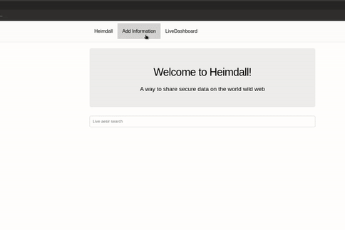

# Heimdall

[](https://github.com/aditya7iyengar/heimdall/actions?query=workflow%3A%22Heimdall+CI%22)
[](https://github.com/aditya7iyengar/heimdall/releases/tag/0.0.2)
[](https://coveralls.io/github/aditya7iyengar/heimdall?branch=develop)
[](https://github.com/aditya7iyengar/heimdall/blob/develop/LICENSE)


Share sensitive information in a secure way with temporary urls and encryption!


## Naming

Heimdall (pronounced _Haim-Dawl_) in norse mythology is the "ever-vigilant" god
who guards Bifrost (pronounced _Byff-Rost_), the rainbow bridge that leads to
Asgard.

## A Simple Solution for a Simple Use Case

You need to share your SSN with someone. You don't want to say it out loud
on phone (you have people around you), and you also don't want to send it in an
email because it will be readily available to anyone who accesses (or hacks)
the recipient email in the future.

Heimdall allows you to share secure information such as your SSN using a
__temporary__ link which disappears in 5 mins or any configurable amount of
time. In this way, if someone does find a way to get the link in the future, it
would likely be expired. You can also choose to encrypt the information using
AES encryption (PGP coming soon) for added security and the key could be
something unique to the receiver (like the name of their first pet). This
further decreases the number of people that could decrypt the information.

### How it looks



## Local setup

### Docker + Ngrok (Recommended)

I recommend running Heimdall using `docker` so you won't have to install all the
dependencies on your host machine.

Once you have `docker` installed, you can just run the following command to
get the server up and running:

`$ docker run -p 127.0.0.1:4010:4010 aditya7iyengar/heimdall:0.0.2`

This command will start up an instance of `Heimdall` locally on your port
`4010`. So, you can access the app at: `http://localhost:4010`

To expose it to publically (to share information with someone), you can use
a tunneling service like `ngrok` or `localtunnel`. Here's how to expose your
port using `ngrok`:

`$ ngrok http 4010`

The above command should return a url through which your local port can be
accessed by anyone. Make sure to stop the `ngrok` process once the information
is already shared.

By Default, the HTTP Basic Auth credentials in the docker container are:

- username: dev_user
- password: secret

The port, HTTP Basic user and HTTP Basic password can all be overriden by
setting the following environment variables during the docker run command:

- `BIFROST_PORT`
- `BIFROST_USER`
- `BIFROST_PASSWORD`

For example:

```
docker run -p 127.0.0.1:4000:4000 \
  -e BIFROST_PORT=4000 \
  -e BIFROST_USER=harry-potter \
  -e BIFROST_PASSWORD=caput-draconis \
  aditya7iyengar/heimdall:0.0.2
```


### Elixir + Ngrok (for Elixir developers)

`Heimdall` is a web app written using [Elixir](https://elixir-lang.org/) and
[Phoenix Framework](phoenixframework.org). Here are the requirements to run it
locally:

- Elixir ~> 1.10.4
- Erlang ~> 22.3.4
- NodeJS ~> 11.15
- Direnv

You can get the server up and running at the default port `4010` by running:

```
$ git clone aditya7iyengar/heimdall
$ cd heimdall
$ direnv allow .
$ mix deps.get
$ mix phx.server
```

_NOTE: You can override defaults by creating `.envrc.custom` file to override
`.envrc` contents_

This command will start up an instance of `Heimdall` locally on your port
`4010`. So, you can access the app at: `http://localhost:4010`

To expose it to publically (to share information with someone), you can use
a tunneling service like `ngrok` or `localtunnel`. Here's how to expose your
port using `ngrok`:

`$ ngrok http 4010`

The above command should return a url through which your local port can be
accessed by anyone. Make sure to stop the `ngrok` process once the information
is already shared.


## Roadmap

- [X] Add "add aesir" link
- [X] Make `Dockerfile` more env friendly
- [X] Add ttl to aesir form in the UI
- [X] Add wrong attempts to aesirs
- [ ] Add geography/IP filter
- [ ] Add limit to number of times the link is decrypted
- [ ] Add incoming aesirs? This will need some thought
- [X] Add an API endpoint for adding aesirs
- [ ] Add a `cli` app that talks to the API
- [ ] Add show/hide key button
- [X] Add notes for `ngrok` integration
- [ ] Deploy w/ `k8s`
- [ ] Add CD
- [ ] Add documentation
- [ ] Add better instructions for Elixir usage
- [ ] Add PGP support
- [ ] Add `credo`
- [ ] Add `dialyzer`
- [ ] Add `inch-ci`
- [ ] Clean up errors/messages using error helpers/gettext
